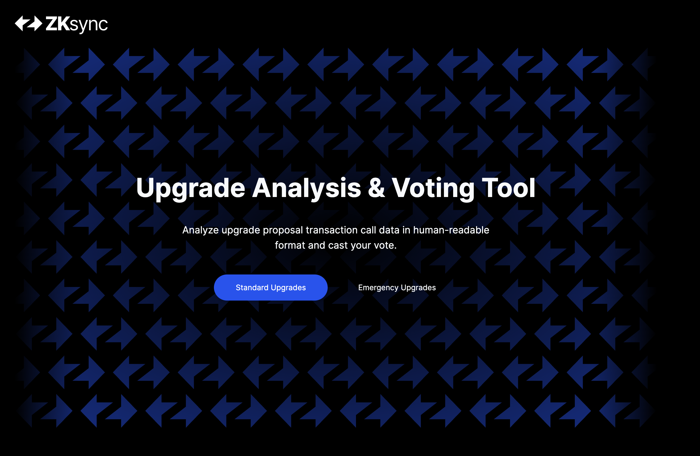
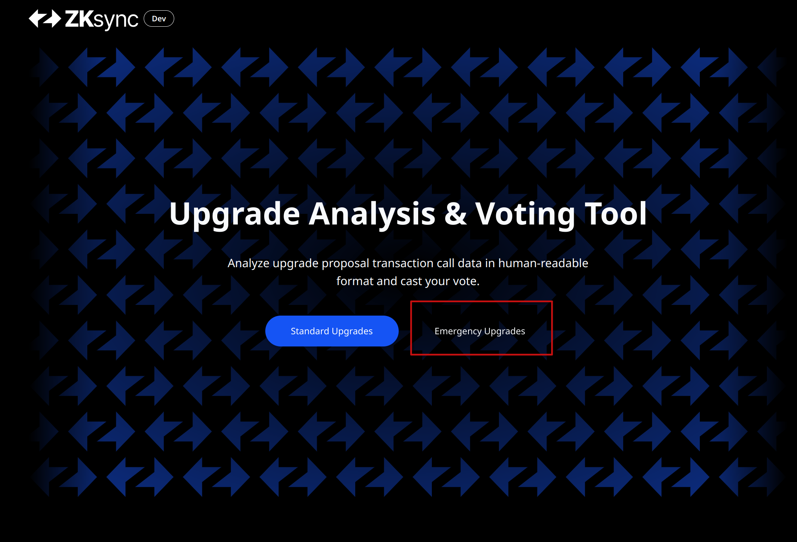
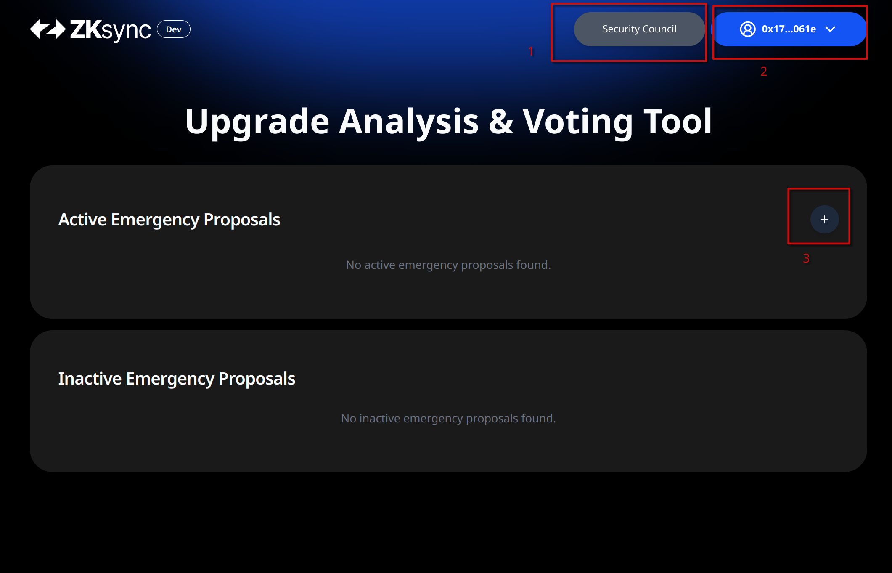
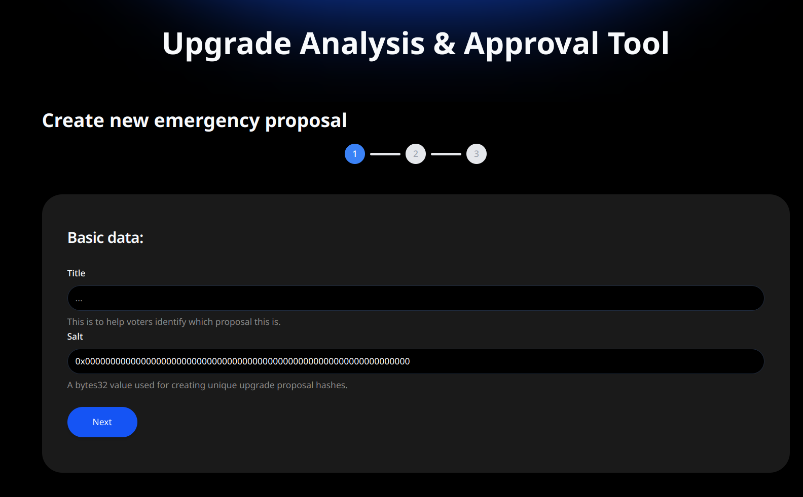
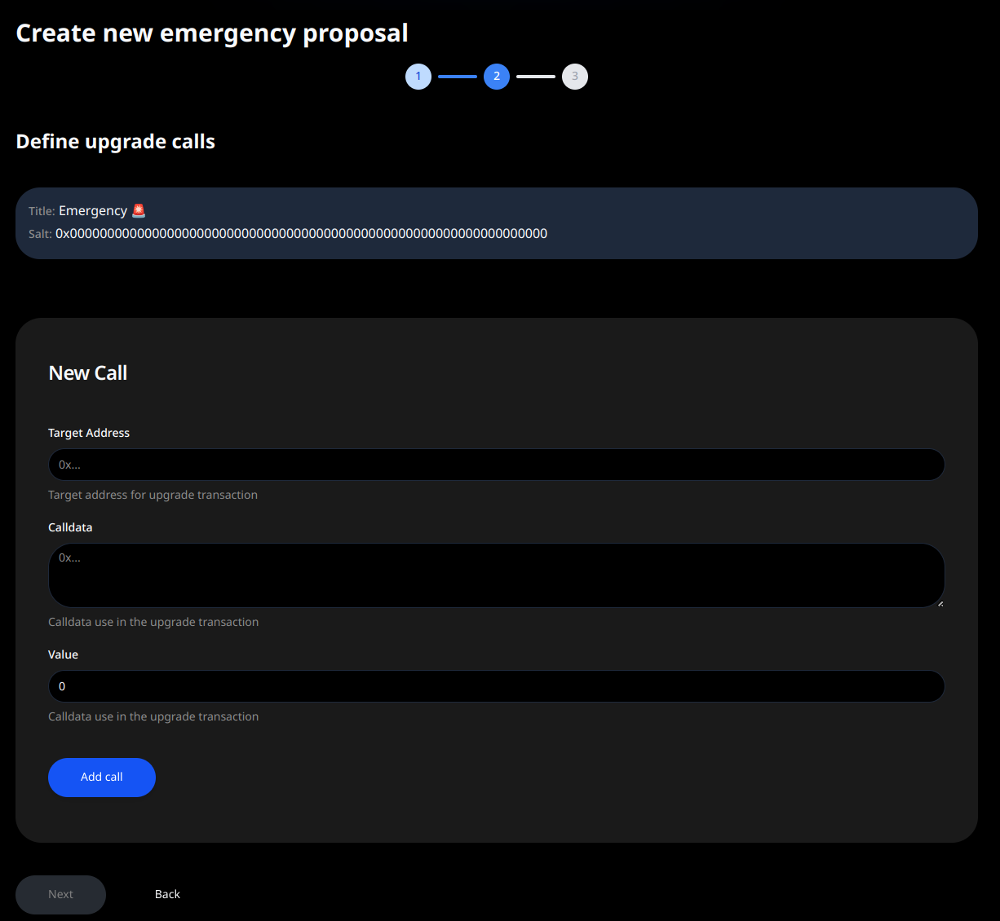
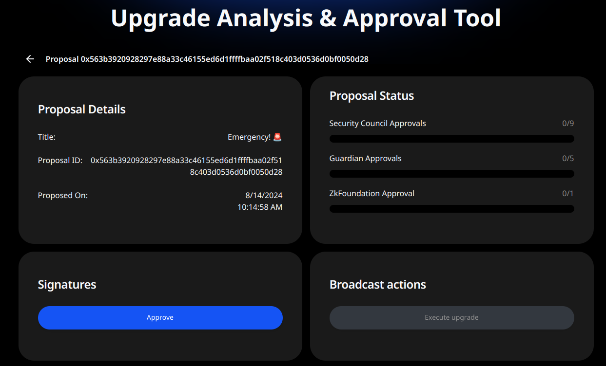
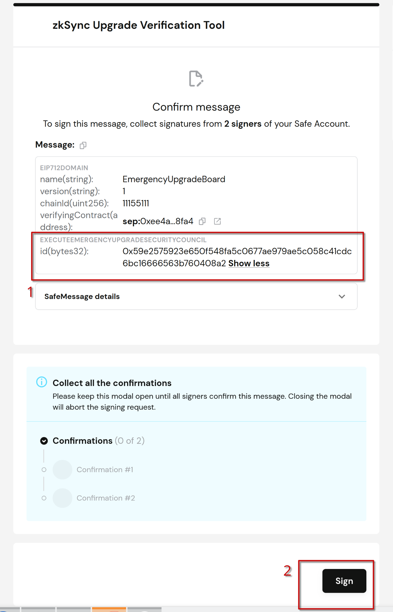
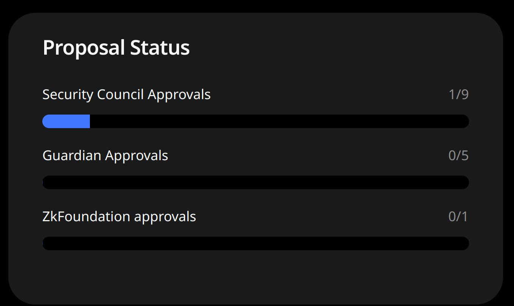

# Emergency upgrade: Rehearsal script

## 🎯 Objective

The objective of the rehearsal is to make guardians and security council members comfortable with the tools used to approve emergency upgrades.

## 📝 Preparation

### 1. Access to Safe and your signing wallet

Every signer of this rehearsal will [sign through a safe](https://safe.global/). Please ensure you have access to your safe and everything needed to produce your signature. This includes having access to your EOA included in the safe (for example, your hardware wallet at hand and linked with MetaMask or your preferred interface for signing will be required). 

**For rehearsals, please remember to choose Ethereum Sepolia Testnet as the network for all your interactions.**

### 2. Access to governance web app

Please ensure you have access to the ZkSync Upgrade Analysis & Approval Web App. This web app is used to coordinate the process of gathering signatures and, in the end, broadcasting the transaction that executes the upgrade.

- Staging link: [https://zksync-upgrade-verification.staging.zknation.io/](https://zksync-upgrade-verification.staging.zknation.io/)

![Note]
👍🏽 All interactions by the members of the security council and the guardians during this rehearsal are off-chain, **so they will not need ETH or any other tokens to fund transactions.** *On-chain transactions will be made by the facilitator of the rehearsal.*

## ✅ **Creating & Approving an Emergency Upgrade**

The governance tool will be used to track the [emergency upgrade flow](https://docs.zknation.io/zksync-governance/schedule-2-emergency-response-procedures#id-3.-emergency-upgrade). This tool will make the off-chain upgrade proposal and gather the signatures for approval. Finally, a single transaction will be built and broadcasted to validate the signatures on-chain and execute the upgrade.

### Step 1: Logging into the governance tool

The first step involves logging into the governance tool using **SAFE through WalletConnect integration.** 

### **Connect Wallet using Wallet Connect**

**You will need to connect to the governance web app with your safe**. Use WalletConnect for that:

If you are using a **mobile wallet you can scan the QR code to continue.** 

Otherwise, **you can open the full wallet connect popup to get the connection URL:**

Once you have copied that link, you can use it inside your safe to connect with the governance web app:

Now, back to the governance web app, you will see that you are already logged in, and you should see something as follows:

## Step 2: Navigate to the Emergency Upgrade Section

Let’s start going to the emergency upgrade section:

If you click on "Emergency Upgrades," you will notice that the upgrade proposal you aim to approve should be in the active emergency proposals section:

Here is a **quick guide to navigate** through this visualization: 

→ **Role & Address**: At the top you will see your role (1) and the address of your safe (2).

→ **Create a new proposal:** The plus sign (3) creates a new proposal.

## Step 3: Creating a new emergency upgrade proposal [Optional]

![Note]
If you only need to approve an emergency upgrade proposal, go to step 4.

If you click on the plus sign, you will be redirected to a new page:

- The **title** field is used internally in the web app (it never goes on-chain). It is just a human-readable name for the upgrade, meant to make it easier for other signers to identify this particular upgrade.
- The **salt** defaults to zero, and we recommend leaving it that way.

Once this is set, you can click next:

Here, you can define one or more ETH calls for the upgrade. Each call requires a target address, calldata, and a value (expressed in ETH).

You can add as many calls as needed, and they will be accumulated at the top:

Once you are ready, click "Next" at the bottom to verify the final data.

Once you click "submit," the proposal will be created, and you will be redirected back to the index page.

## Step 4: Find and review the Emergency Upgrade

Once you select the target emergency proposal, you will see further details about the proposal and the approval process. After clicking on the "view" button, you will see a screen like this:

After clicking on the "view" button, you will see a screen like this:

Here is a **quick guide to navigate** through this visualization: 

→ **Proposal Details:** At the **top left**, you can see general information about the upgrade proposal. Here you will find details to identify the proposal. 

→ **Proposal status:** At the **top right**, the app shows data regarding the proposal status. This mainly provides insights into the current approvals for Guardians, Security Council and ZK Foundation.

→ **Security Council, Guardians or ZK Foundation Actions:** The actions on the bottom left are specific to your account. For example, Security Council members will only see an "approve" button because their only possible action is to approve the proposal.

→ **Proposal Actions:** The actions on the bottom right are not tied to any specific role. Anyone can perform them at the appropriate time, but they all involve on-chain transactions. For example, "Broadcast Upgrade" can only be done when all signatures of the 3 bodies were collected. 

![Caution]
🚨 To complete this step, please verify that is the correct emergency proposal. Check it multiple times, compare it with your own data, and double-check that it's the upgrade you expect to approve.

## Step 5: Verify Upgrade Proposal integrity

This is the moment when the upgrade information should be verified and double-checked.  

→ **Upgrade Analysis**: At the **bottom of the page**, the app will display the raw data correspondent to the upgrade. 

However, each signer needs to do their own verification. **Remember that this is a security-focused procedure, so you should not trust anything, not even the information displayed by the browser**. You must keep an eye out for anything that may seem off and review with external tools that the data showcases what you expect. Even if it looks as expected in the app, you must do your outside verification before proceeding. 

![Caution]
Each signer is responsible for the verification process. You should perform your own integrity analysis and verify all web app data with external sources to confirm before proceeding.

As a general reminder, signers should review:
→ Official communications
→ Upgrade code changes
→ Web App Raw data
→ Etc.

**Everything that is considered necessary to verify the integrity of the proposal must be reviewed during this process.**

## Step 6: Sign for the approval of the Upgrade Proposal

Once you verify all the data and feel comfortable with the upgrade, you can add your signature to approve the proposal by **clicking the "approve proposal” button**. 

This will send a petition to sign in your safe that includes the action (ApproveUpgradeSecurityCouncil) and the ID of the upgrade. 

**What comes next is REALLY important  👇🏽**

The message to sign (1) shows the action being executed ("EXECUTEEMERGENCYUPGRADESECURITYCOUNCIL") and the ID of the upgrade (0x59e.... in this case). It's crucial to double-check and triple-check this ID. The upgrade with that ID is the one that will be executed.

![CAUTION] **It’s extremely important to check that the ID matches the ID of the upgrade you want to sign**. Whatever is signed here is being approved to make a protocol upgrade, so it’s very important to check, double-check, and triple-check the correctness of that ID. Don't rely solely on the ID shown in the web app; please verify this proposal ID as thoroughly as possible before proceeding.

After checking the ID, you can click on the sign. From there, two possible flows could follow: 

- **Pending signatures from SAFE:** The minimum threshold to sign will need to be reached in SAFE to sign the proposal. In this case, the signature will be pending in SAFE till this happens.
- **Minimum threshold reached:** If the minimum amount of confirmations for the SAFE is reached, safe will automatically send the final signature to the governance web app.

**Once the confirmations are reached and the message is signed through SAFE**, the signature will be collected and you should see that 1 approval is registered in the governance tool. The signature created by your SAFE is saved off-chain by the web app, in a local database.

![Note]
 *If you are not the last signer of your safe, you will not see any change in the governor web app. That’s fine. When every signer of the safe approves the upgrade, a single signature is registered for the entire safe.* 

## Step 7: Broadcasting the upgrade

Once the required members from the 3 bodies approved the upgrade, a transaction is needed to broadcast the upgrade on-chain. The facilitator of the process will handle this and will be the end of the process.