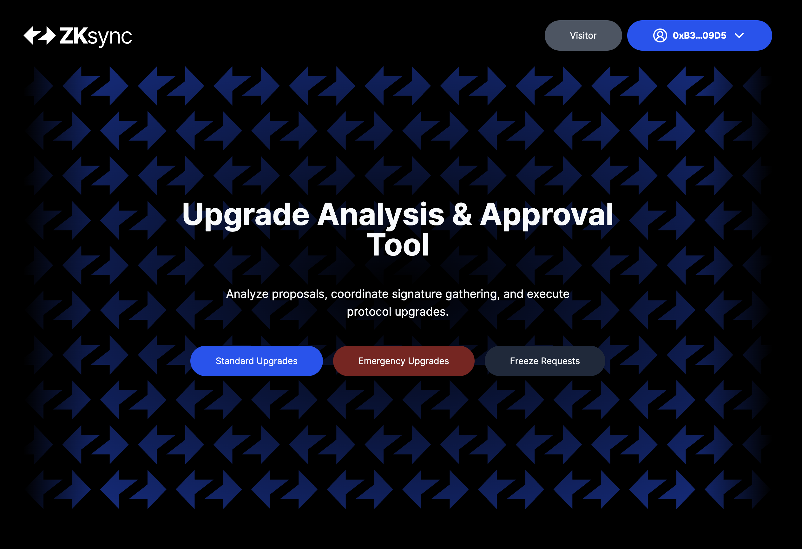
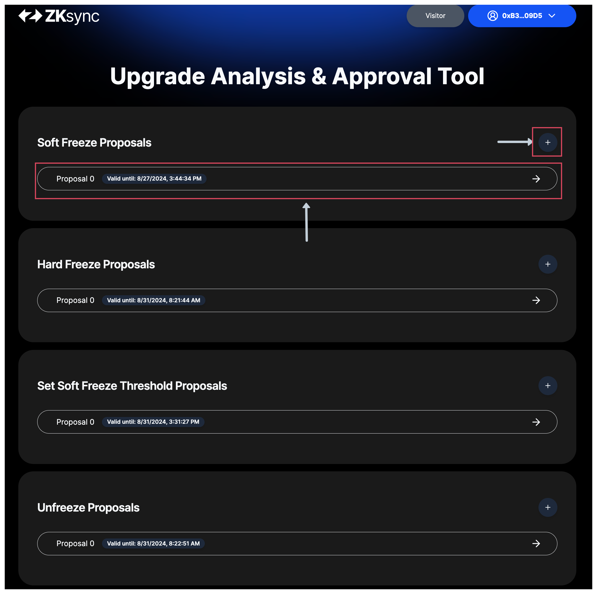

# Freezing Rehearsal: User Guide

## 🎯 **Objective**

The objective of this documentation is to guide the security council members through the tool & process used to freeze/unfreeze the protocol.

## 📝 **Preparation**

### 1. Access to Safe and your signing wallet

Every signer of this rehearsal will [sign through a safe](https://safe.global/). Please ensure you have access to your safe and everything needed to produce your signature. This includes having access to your EOA included in the safe (for example, your hardware wallet at hand and linked with MetaMask or your preferred interface for signing will be required). 

***For rehearsals, please remember to choose Ethereum **Sepolia Testnet** as the network for all your interactions.***`

### 2. Access to governance web app

Please ensure you have access to the ZkSync Upgrade Analysis & Approval Web App. This web app is used to coordinate the process of gathering signatures and, in the end, broadcasting the transaction that executes the upgrade.

- Staging link: [https://verify.staging.zknation.io/](https://verify.staging.zknation.io/)

> [!Note]
👍🏽 All interactions by the members of the security council during this rehearsal are off-chain, **so they will not need ETH or any other tokens to fund transactions.** *On-chain transactions will be made by the facilitator of the rehearsal.*

## ❄️ **Freezing/Unfreezing through the web app**

### Step 1: Logging into the governance tool using SAFE

The governance web app is used to follow the [soft/hard freeze, unfreezing & setting a new soft freeze threshold procedure](https://docs.zknation.io/zksync-governance/schedule-2-emergency-response-procedures#id-2.-freeze). It facilitates creating proposals & gathering the necessary signatures for this actions. Finally, it builds the transactions that validate all the gathered signatures on-chain and execute the proposal.

The first step involves logging into the governance tool using **SAFE through WalletConnect integration.** 

### **Connect Wallet using Wallet Connect**

![Note]
Remember that you will need to connect to the governance web app with your **SAFE** & choose **Ethereum Sepolia Testnet** as the network for all your interactions.

**You will need to connect to the governance web app with your safe**. Use WalletConnect for that:

If you are using a **mobile wallet you can scan the QR code to continue.** 

Otherwise, **you can open the full wallet connect popup to get the connection URL:**

Once you have copied that link, you can use it inside your safe to connect with the governance web app:

Now, back to the governance web app, you will see that you are already logged in, and you should see something as follows:

## Step 2: Find the Freezing Section and Review Freezing Proposals Details

Let’s start going to the freezing section:

If you click on "Freeze Requests", you will enter the following section with existing proposals related to freezing:

Below are the four key sections on this page, each corresponding to a different type of freezing proposal:

1. **Soft Freeze Proposals:** The section lists the active soft freeze proposals. Each proposal is associated with a validity period, which indicates how long the proposal signature gathering remains in effect.

2. **Hard Freeze Proposals:** This section displays the hard freeze proposals currently in place, along with their validity periods.

3. **Set Soft Freeze Threshold Proposals:** It lists proposals that suggest changes to the current soft freeze thresholds. 

4. **Unfreeze Proposals:** This section displays proposals that aim to unfreeze the system, along with their respective validity periods.

Each proposal type has a **nonce** associated (in the image an example of "Proposal 0" used for testing purposes) and a **valid date** that are used as arguments during the signing process. All signatures are associated with them for security reasons.
- The **nonce** is used to identify the proposal relative to the number of the proposal that can be currently implemented.
- The **valid date** is used to determine the validity of the voting for the proposal.

There are two common reasons why a freezing proposal can become inactive:

- **The signature gathering period has ended.**
- **The proposal nonce has been used.**

In both cases, the proposal will be marked as inactive and will not be able to be executed. 

![Note]
**Navigation**: You can click on **the arrow (->)** to view more details about each proposal or the **“+” button** to add a new proposal. **Creation of a new proposal is only possible if there is no active proposal with the same nonce.**

## Step 3: Verify Freezing Proposal Information

This is the moment when the freezing proposal information should be reviewed.

![Note]
The 4 types of freezing proposals follow the same structure, so it is important to review the information for each type of proposal. In the case of setting the soft freeze threshold, it is important to review actual threshold and the proposed threshold.

For this example, we will review the information for a *soft freeze* proposal.

When you click on a specific proposal, such as “Soft Freeze Proposal 0,” you are brought to a detailed view where you can explore various aspects of the proposal. This view is crucial for understanding the specifics of the proposal and for taking any necessary actions. The section is divided into four main parts:

1. **Proposal Details:** This section provides the key timestamps related to the proposal, including when it was proposed and until when it is valid.

2. **Proposal Status:** The status section tracks the approval progress of the proposal. The bar and counter indicate how many approvals have been gathered out of the total required. For example, “0/3” suggests that none of the three required approvals have been obtained yet.

3. **Role Actions:** This area will display actionable options relevant to the user’s role. Only users with the security council role will be able to view in this section the approve freeze button. 

4. **Execute Actions:** In this section, the execute Freeze button will allow you to carry out the soft freeze specified in the proposal. However, it will only be clickable (i.e., not grayed out) once all conditions, like approvals, are satisfied.

> [!Caution]
🚨 **Each signer is responsible for the verification process**. You should perform your own integrity analysis and verify all web app data with external sources to confirm before proceeding. 

**Everything that is considered necessary to verify the integrity of the proposal must be reviewed during this process.**

## Step 4: Sign for the approval of the Upgrade Proposal

Once you verify all the data and feel comfortable with the upgrade, you can add your signature to approve the proposal by **clicking the "approve proposal” button**. 

This will send a petition to sign in your safe that includes the action (it will depend on the type of proposal) 

**What comes next is REALLY important 👇🏽**

> [!Caution]
🚨 **It’s extremely important to check that everything matches to the freezing type and proposal you want to sign**. Whatever is signed here is being approved will affect the protocol, so it’s very important to check, double-check, and triple-check the correctness of the information before signing.

After reviewing all the information, you can click on sign. From there, two possible flows could follow:

- **Pending signatures from SAFE:** The minimum threshold to sign will need to be reached in SAFE to sign the proposal. In this case, the signature will be pending in SAFE till this happens.
- **Minimum threshold reached:** If the minimum amount of confirmations for the SAFE is reached, safe will automatically send the final signature to the governance web app.

Once the confirmations are reached and the message is signed through SAFE, the signature will be collected and you should see that 1 approval is registered in the governance tool. The signature created by your SAFE is saved off-chain by the web app, in a local database.

> [!Note]
👍🏽  *If you are not the last signer of your safe, you will not see any change in the governor web app. That’s fine. When every signer of the safe approves the upgrade, a single signature is registered for the entire safe.*

## Step 5: Executing the freezing proposal

Once approval threshold is reached, a transaction is needed to register those approvals on-chain. The facilitator of the process will handle this.

![Note]
For more information on the freezing process, please refer to the [the freeze section](https://docs.zknation.io/zksync-governance/schedule-2-emergency-response-procedures#id-2.-freeze).